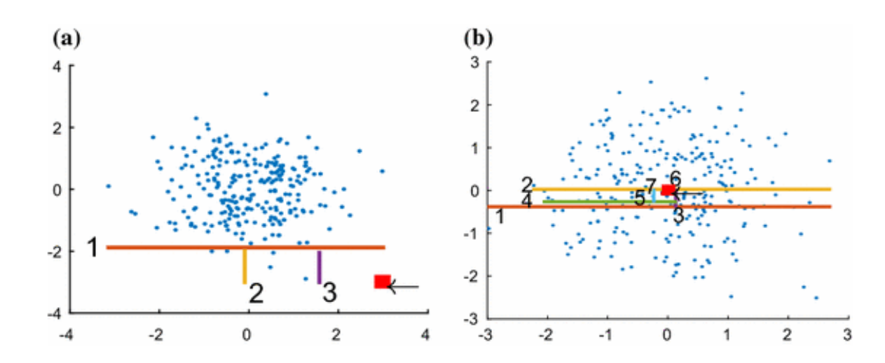

oam.score
=========

The score-and-search approach requires a scoring function, to measure how much
the object differs from the rest in a subspace.

Till the moment we have only implemented the Ipath scoring method that consists
of making cuts in space, isolating objects from the rest
of the dough. In this scenario, if the object is surrounded by several others, you will need to
more cuts to separate it from the rest, while if the object is an outlier, it will take
less cuts. This behavior can be observed in Figure 1, where (a) represents the
procedure of an outlier that was isolated with only three cuts, while (b), a value
not considered an outlier, it needed 7 cuts to be isolated from the rest of the data.

To extend the lib with a different algorithm just make sure it has an *score* method returning an *integer* as the
outling score.

You can find more details about it in the `repo README <https://github.com/rodrigo-fss/python-oam//>`_!

oam.score.isolation\_path
-------------------------

.. automodule:: oam.score.isolation_path
   :members:
   :undoc-members:
   :show-inheritance:
